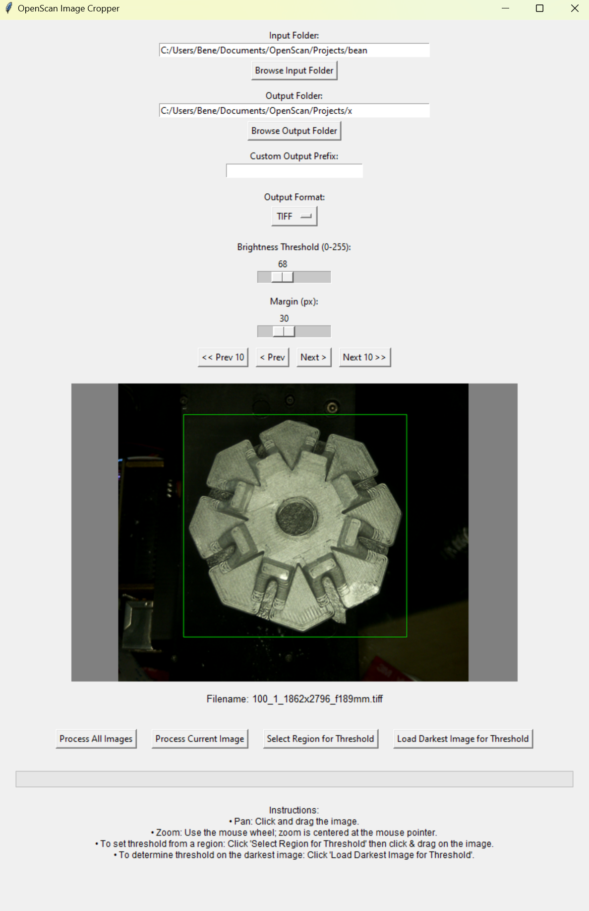

OpenScan Image Cropper is a Python-based GUI tool designed to crop images based on brightness levels. It offers features such as live preview, interactive threshold selection (including region-based and darkest-image options), and batch processing capabilities.



## Features

- **Live Preview:** Provides a preview of your image with panning and zooming functionalities.

- **Threshold Selection:**
  - **Region Selection:** Set the threshold by selecting a specific region on the image.
  - **Darkest Image Analysis:** Automatically loads the darkest image from a folder to assist in determining a suitable threshold.

- **Batch Processing:** Process all images in a folder with an integrated progress bar.

- **Single Image Processing:** Process only the currently displayed image.

- **Custom Output Options:**
  - Set a custom file prefix.
  - Choose the output file format:
    - Original
    - TIFF
    - PNG
    - JPG


**Prerequisites:**

Running from Source Code
Python 3.x: Ensure Python 3.x is installed.
Required Packages: Install the necessary packages using pip:

```bash
pip install opencv-python Pillow
```

Tkinter: Typically included with Python installations on Windows.
if not run:
```bash
pip install tk
```

**Prerequisites for EXE file**
No additional prerequisites are required.
Note: The executable may trigger warnings from Windows Defender or similar antivirus software as it is not signed. Users might need to allow the file manually or disable windows defender.


**Running from Source**
Open a command prompt in the project folder and execute the following command:

```bash
python OpenScanImageCropper.py
```

**Using the EXE Executable**
Download and run the executable file.
If Windows Defender flags the file, choose to allow or unblock it.

[Download OpenScanImageCropper.exe](./dist/OpenScanImageCropper.exe)


**Building the EXE Executable**
If you would like to verify your own EXE file, you can create the exe with a single line of code.
To create a standalone executable, use PyInstaller from the root directory:

```bash
pyinstaller --onefile --windowed OpenScanImageCropper.py
```
**Troubleshooting**
Antivirus Warnings
You may need to temporarily disable your Windows Defender to build and execute the exe file, as the file will not be signed.

**Contributing**
Contributions and feedback are welcome! Please fork the repository and submit a pull request.
